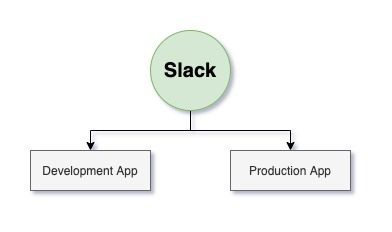
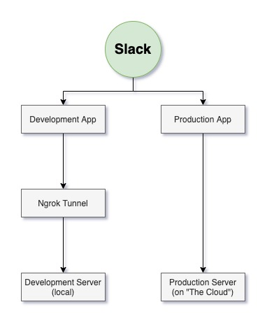
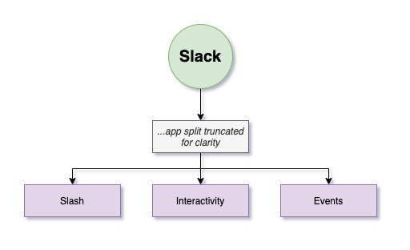
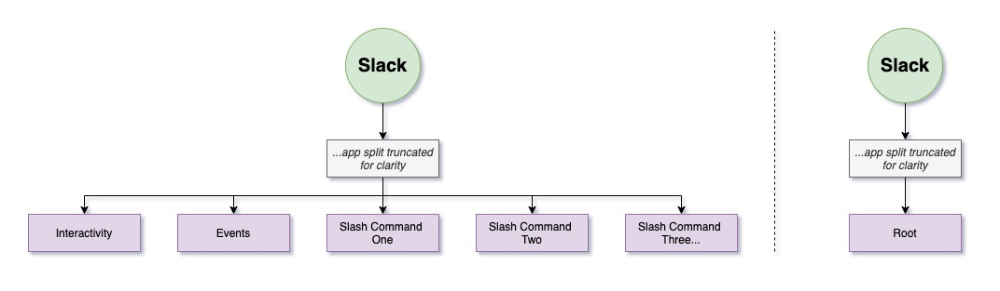
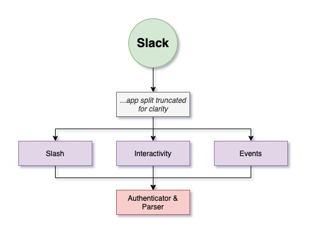
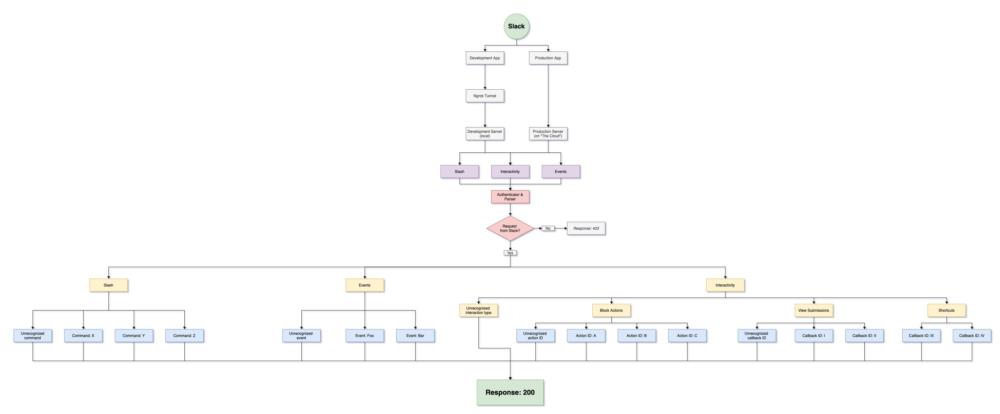

# Slack Apps

There's two main parts to Thoth. There's the AWS infrastructure (Lambda, API Gateway, AWS Events, etc.) and there's the Slack infrastructure. This guide will focus on explaining the logic behind the Slack side to both help future developers extend Thoth or to help developers working on Slack Apps of their own.

Each section will start with a visual representation of what your app should look like at the end of that section. If it's confusing at first, read the section and then come back to it. It'll expand with more parts as the guide continues.

## Slack Dashboard

The best place to start is by making an app in [the Slack dashboard](https://api.slack.com/apps). Once you assign it some [permissions](https://api.slack.com/scopes) you should be able to install it in your workspace. If you need one to get started just add `channels:read` which allows the app to see basic info about public channels.

Once installed, you can get some credentials you need and get back to coding: get the `Signing Secret` from `Basic Information` and get `Bot User OAuth Token` in `OAuth & Permissions`. The former you'll use to authenticate requests from Slack and the latter you'll use so Slack authenticate's your requests.

I tend to make two Slack apps (one for development in a development workspace and one for production in my actual workspace). This makes me feel better about experimenting and also means I don't have to constantly switch the URLs the app is pointing to (more on that later).

## Development

The first hurdle to creating a Slack app is setting up a development server. Any dev server framework will work as long as there isn't any automatic parsing of requests (e.g. JSON strings or URL-encoded strings). The reason for this is you need to full as-is request body in string form in order to authenticate the request (see Authentication).

This app has a JavaScript implementation using the popular [`express`](https://expressjs.com/) framework found in `src/dev.js`. The dev server in this app has a custom bare-bones parser which passes the data along to meet the above requirement. This also mimics API Gateway's parsing (or lack of) if you choose to use it.

Next you need an HTTPS endpoint, to test incoming requests from Slack, but you want to develop locally. In comes [ngrok](https://ngrok.com/) which creates a "tunnel" from an HTTPS server to your local development server. If you sign up for ngrok you can specify your subdomain, otherwise it creates a new one every time you recreate the tunnel. Either way, once you have your ngrok subdomain at an HTTPS address, you can paste it into various parts of your Slack app to start testing.

## Routes

Next up, you need to route Slack actions in your App Manager to specific routes in your app. There's a few strategies to do this, and I'll be discussing the one used in this app where necessary. There's three types of payloads Slack will be sending you: commands, events, and interactivity.

[Commands](https://slack.com/help/articles/201259356-Slash-commands-in-Slack) are when a user types a `/` into their box and then fills in a specific command. Events allow you to subscribe your app to the happenings of your workspace. There's a whole [list](https://api.slack.com/events) of events that your app can be notified of when they occur (this app doesn't have an implementation of this type of payload yet). Interactivity payloads come in when users interact with your forms and messages' inputs (e.g. buttons, select menus, date-pickers, etc.). When a user uses [a shortcut](https://api.slack.com/interactivity/shortcuts/using) created by your app, payloads get sent as interactivity as well.

All events and interactivity have to go to one endpoint each (i.e. one for events and one for interactivity) while Slash commands can each have their endpoint. In order to avoid confusion, this app sends all slash commands to one endpoint too. You could also implement a strategy where all three of these all go to your root endpoint and not worry about multiple routes, but I've found that these three payloads are not consistent with each other and it creates unnecessary complexity in a parser.

_These are visualizations of other strategies for handling your routing, but they are NOT suggested by this guide._

## Authentication

Once you have a URL in your Slack app pointing to an endpoint on your local dev server (using the ngrok tunnel) you can begin receiving requests. But before you can do anything with them, you have to authenticate that they came from Slack. The technical explanation of what you need to do can be found [here](https://api.slack.com/authentication/verifying-requests-from-slack).

This comes with a JavaScript implementation you can find in `src/utils/parseAndAuthenticate/slack.js`. This implementation will authenticate the payload and return a parsed version into a JSON object (or `false` if the authentication failed).

## More TK
The rest of this guide is coming soon...

In the meantime, here's the full graph once completed:

